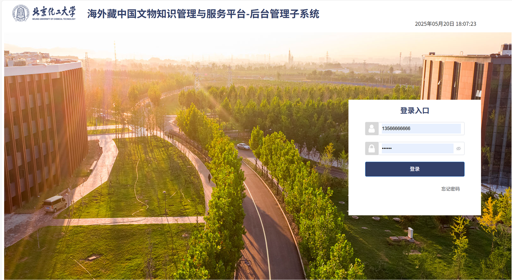
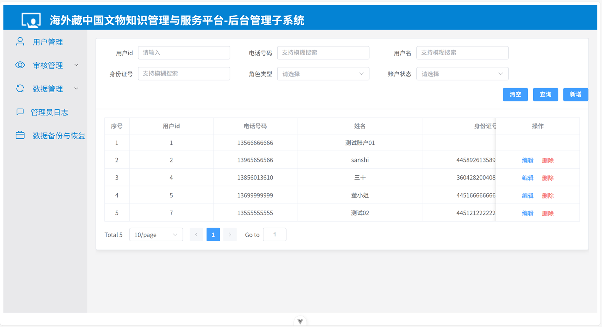
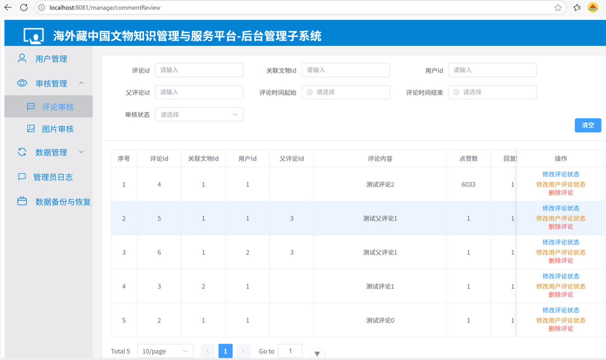
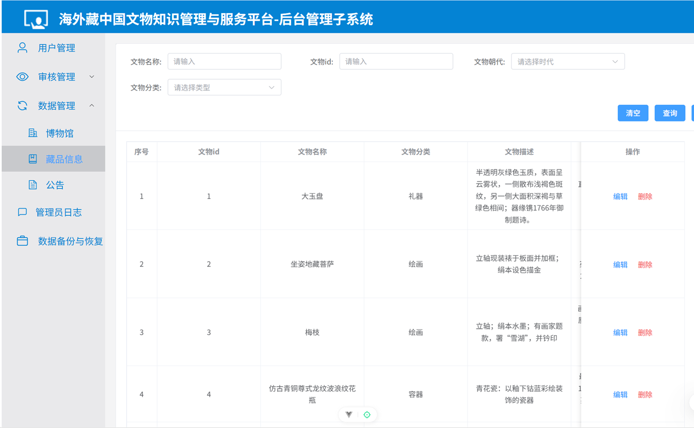
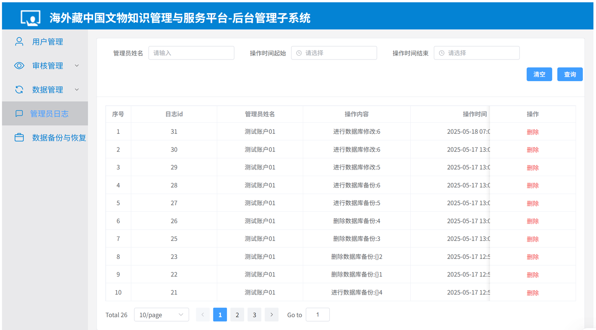
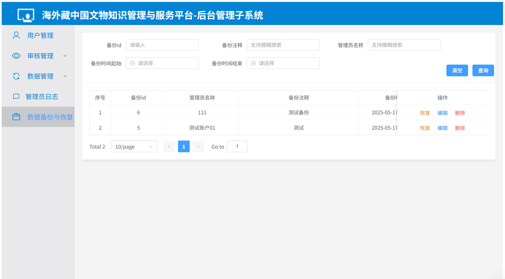

# 后台管理子系统项目文档

## 一、项目介绍
本后台管理子系统是一个基于前后端分离架构开发的管理系统，前端使用Vue 3 + Vite框架，后端使用Spring Boot 3框架。系统旨在实现对博物馆、藏品、用户、评论、新闻等信息的有效管理，同时具备登录、审核、日志记录和数据库备份等功能。

### 功能模块
1. **登录模块**：实现用户的登录、登出、修改密码等操作。
2. **用户管理模块**：对用户信息进行增删改查，以及管理用户评论状态。
3. **审核模块**：对评论、图片等信息进行审核。
4. **数据管理模块**：包括博物馆管理、藏品管理、用户评论管理和新闻管理。
5. **日志模块**：记录系统操作日志，支持日志的查询、删除和添加。
6. **数据库备份模块**：实现数据库的备份和恢复功能。

### 架构设计

## 二、前后端环境部署

### 前端环境部署
#### 1. 安装Node.js
确保你的系统已经安装了Node.js（建议版本 >= 14.16），可以从[Node.js官网](https://nodejs.org/)下载并安装。

#### 2. 克隆项目
将项目克隆到本地：
```bash
git clone https://github.com/BUCT-CS2201/BackendManagement.git
```

#### 3. 安装依赖
进入前端项目目录：
```bash
cd BackendManagement/front/background-management-system
```
安装项目依赖：
```bash
npm install
```

### 后端环境部署
#### 1. 安装Java和Maven
确保你的系统已经安装了Java（建议版本 >= 17）和Maven，可以从[Java官网](https://www.oracle.com/java/technologies/javase-downloads.html)和[Maven官网](https://maven.apache.org/download.cgi)下载并安装。

#### 2. 配置数据库
本项目使用MySQL数据库和Redis作为中间件，需要提前安装并配置好。

- **MySQL**：创建一个新的数据库，并记录好数据库的用户名、密码、主机和端口。
- **Redis**：启动Redis服务。

#### 3. 配置后端项目
进入后端项目目录：
```bash
cd BackendManagement/backend/background-management-system
```
打开`src/main/resources/application.yml`文件，配置数据库和Redis信息：
```yaml
spring:
  datasource:
    url: jdbc:mysql://${cultural-relics.service.database.host}:${cultural-relics.service.database.port}/${cultural-relics.service.database.dbName}
    username: ${cultural-relics.service.database.username}
    password: ${cultural-relics.service.database.password}
    driver-class-name: com.mysql.cj.jdbc.Driver
  redis:
    host: ${cultural-relics.service.redis.host}
    port: ${cultural-relics.service.redis.port}
    password: ${cultural-relics.service.redis.password}
```

#### 4. 构建项目
使用Maven构建项目：
```bash
mvn clean package
```

## 三、项目运行

### 前端项目运行
在前端项目目录下，启动开发服务器：
```bash
npm run dev
```
打开浏览器，访问`http://localhost:8081`即可看到项目界面。

### 后端项目运行
在后端项目目录下，运行生成的JAR文件：
```bash
java -jar target/background-management-system-*.jar
```
后端服务将启动在`http://localhost:8080`。

## 四、主要功能展示
1. 登录

2. 用户管理

3. 审核管理

4. 文物管理

5. 日志管理

6. 数据备份与恢复
